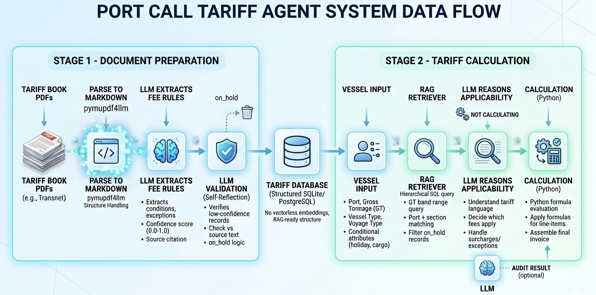
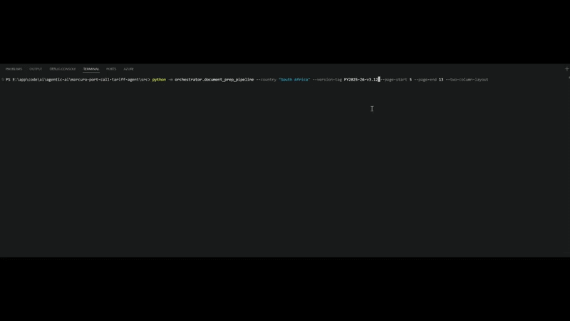
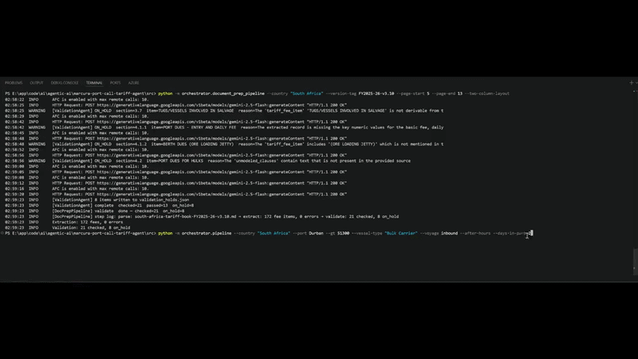

## What This Is

Port call tariff books are dense, annually-revised PDF documents. South African ports (Transnet National Ports Authority) publish a schedule of fees that apply to every vessel calling at a port — structured by gross tonnage band, vessel type, port of call, voyage direction, time of arrival, and a set of conditional surcharges and exceptions that don't reduce to a simple lookup table.

Getting the calculation right requires reading the source text, interpreting which rules apply to a specific vessel's attributes, applying formulas, and handling edge cases that the tariff explicitly identifies but can't easily model. Doing this manually for every port call is slow and error-prone. Doing it with a generic LLM is inaccurate because the LLM has no ground truth — it generates numbers, not calculates them.

This system takes a different approach:

- **Stage 1** ingests the tariff book PDF into a structured hierarchical vectroless store for RAG. An LLM reads each section and extracts fee records with their conditions, surcharges, exceptions, confidence scores, and source citations. A second LLM pass verifies low-confidence records before they reach any calculation.
- **Stage 2** queries that database for a given vessel, sends the candidate fees to an LLM to reason about applicability (not to calculate), then evaluates formulas in Python and assembles a line-item invoice.

The arithmetic never happens inside an LLM. The LLM's role is to understand the tariff language and decide what applies — not to produce numbers.

Current coverage: South Africa, FY2025-26 tariff book. The architecture accommodates additional countries and annual tariff versions without code changes.

---

## Solution Flow

### High-Level Design

```
                       STAGE 1 — Document Preparation
┌────────────────────────────────────────────────────────────────────────────┐
│                                                                            │
│   PDF  ──►  Parse to    ──►  LLM Extracts    ──►  LLM Self-Reflection    │
│            Markdown          fee rules             (Validation Pass)       │
│            (pymupdf4llm)     per section           low-confidence items   │
│                              → SQLite DB           verified vs source     │
│                                                                            │
└────────────────────────────────────────────────────────────────────────────┘
                                    │
                                    │ Tariff Database (SQLite / PostgreSQL)
                                    ▼
                       STAGE 2 — Tariff Calculation
┌────────────────────────────────────────────────────────────────────────────┐
│                                                                            │
│   RAG           ──►  LLM               ──►  Calculation   ──►  Output    │
│   Vectorless         Reasons fee             Python                        │
│   Hierarchical       applicability           formula eval                  │
│   SQL query          per candidate           No LLM involved              │
│   (port + GT band)   (conditions,            LLM audits                   │
│                       surcharges,            result afterward             │
│                       exceptions)                                          │
│                                                                            │
└────────────────────────────────────────────────────────────────────────────┘
```

The retrieval step uses structured SQL — port name match, GT band range query, section order — not vector embeddings. Every retrieved record is directly traceable to a tariff section and explainable without an LLM. The LLM reads the candidate fees and determines which apply to this specific vessel; Python applies the formulas. This keeps the calculation auditable and the LLM working on language interpretation, not arithmetic.

---

### Stage 1 — Document Preparation (Detailed)

```
context-layer/rag/raw/{country_slug}/*.pdf
  e.g. context-layer/rag/raw/south-africa/Publisher-Tariff-Book-FY-2025-26.pdf
          │
          ▼
  ┌───────────────┐
  │ parser_agent  │   pymupdf4llm converts PDF pages to Markdown.
  │               │   Two-column layouts are split into single-column
  │               │   before conversion. Output written to:
  └───────┬───────┘   context-layer/rag/out/{country_slug}-tariff-book-{version}.md
          │
          ▼
  ┌──────────────────────┐
  │ rule_extractor_agent │   Section tree is built from Markdown headings.
  │                      │   Sections with direct fee content → LLM call.
  │                      │   Sections that delegate to subsections → recurse.
  │                      │   Empty sections → skip.
  │                      │
  │                      │   Per qualifying section, LLM extracts:
  │                      │     - fee item name, section number
  │                      │     - base fee, GT band, port
  │                      │     - conditions, surcharges, exceptions
  │                      │     - extraction confidence (0.0–1.0)
  │                      │     - unmodeled clauses (verbatim)
  │                      │     - source page reference
  │                      │
  │                      │   Injection-sanitized before prompt assembly.
  │                      │   LLMOutputGuardrail validates schema after.
  │                      │   Resumable: completed sections are logged and skipped.
  └──────────┬───────────┘
             │ upsert into TariffStore
             ▼
  ┌──────────────────┐
  │ validation_agent │   Second LLM pass on records where:
  │                  │     extraction_confidence < 0.6, OR
  │                  │     unmodeled_clauses is non-empty
  │                  │
  │                  │   LLM receives source Markdown + extracted record.
  │                  │   Verdict: valid | on_hold
  │                  │
  │                  │   on_hold:
  │                  │     - confidence set to 0.0 in DB
  │                  │     - written to validation_holds.json
  │                  │     - blocked from all future retrievals
  └──────────┬───────┘
             │
             ▼
  context-layer/rag/db/
  south-africa-tariff-store-FY2025-26-v3.3.db
```

---

### Stage 2 — Tariff Calculation (Detailed)

```
  VesselInput { port, gross_tonnage, vessel_type, voyage_type,
                after_hours, public_holiday, in_ballast, cargo_type, ... }
          │
          ▼
  ┌──────────────────────┐
  │ VesselInputGuardrail │   Hard: GT > 0, port non-empty, voyage in allowed set
  │                      │   Soft: unusual GT range, missing optional fields → warnings
  └──────────┬───────────┘
             │
             ▼
  ┌──────────────────────┐
  │  retriever_agent     │
  │                      │   SQL: SELECT * WHERE port=? AND gt_min<=GT AND gt_max>=GT
  │                      │        Covers: vessel's port, "All" ports, "Other" ports
  │                      │
  │                      │   Port-conflict resolution:
  │                      │        port-specific row wins over "Other" for same fee item
  │                      │
  │                      │   Deduplication (same section + fee_item + GT range):
  │                      │        keep row with fewest unmodeled clauses, then highest confidence
  │                      │
  │                      │   RetrievalGuardrail: drop confidence < 0.2
  │                      │   HoldsFilter: drop items in validation_holds.json
  │                      │
  │                      │   LLM receives all candidate fees + vessel attributes.
  │                      │   Returns applicability verdict per fee:
  │                      │        applies, reasoning, active_surcharge_conditions,
  │                      │        needs_human_review, review_reason
  └──────────┬───────────┘
             │ ApplicableFeeRecord list
             ▼
  ┌──────────────────────┐
  │  calculator_agent    │
  │                      │   §1: Python formula eval (GT, base_fee, increment, bounds)
  │                      │       Sandboxed eval — only math builtins available.
  │                      │       Formula errors recorded per line item, do not block invoice.
  │                      │
  │                      │   §2: CalculationGuardrail
  │                      │       Negative amounts or values beyond sanity thresholds
  │                      │       → flagged for human review
  │                      │
  │                      │   §3: LLM audit pass
  │                      │       LLM receives computed amounts + fee metadata.
  │                      │       Flags discrepancies, exceptions, and unusual values.
  │                      │       Does not change the computed numbers — annotates them.
  │                      │
  │                      │   §4: Invoice assembly
  └──────────┬───────────┘
             │
             ▼
  TariffInvoice {
    line_items: [ { section, tariff_item, port, gt_range, base_amount,
                    surcharge_amount, total, formula_used, source_page,
                    needs_human_review, review_reason, notes } ],
    subtotal,
    human_review_items,
    computation_notes
  }
```

---

## Architecture



## Demo video
### Extraction

### Execution

## Setup

### Requirements

- Python 3.11+
- A Google Gemini API key, or credentials for another LangChain-supported provider
- The TNPA tariff book PDF — upload via API or place manually in `context-layer/rag/raw/south-africa/`

### Install

```bash
git clone <repo>
cd marcura-port-call-tariff-agent

python -m venv .venv

# Windows
.venv\Scripts\activate
# macOS / Linux
source .venv/bin/activate

pip install -r requirements.txt
```

### Environment Variables

Create a `.env` file at the project root:

```env
# LLM provider — any LangChain init_chat_model provider string
LLM_MODEL=google_genai:gemini-2.5-flash

# Google Gemini (when LLM_MODEL starts with google_genai)
GOOGLE_API_KEY=your-api-key
GOOGLE_GENAI_USE_VERTEXAI=0

# Optional overrides
RETRIEVAL_MIN_CONFIDENCE=0.2    # minimum confidence to pass RetrievalGuardrail
```

To switch providers without any code changes:

```env
LLM_MODEL=anthropic:claude-sonnet-4-6
LLM_MODEL=openai:gpt-4o
LLM_MODEL=azure_openai:gpt-4o
```

### Stage 1 — Ingest a Tariff Book

**Place the PDF first.** The pipeline looks for the PDF in the country's subdirectory:

```
context-layer/rag/raw/south-africa/Publisher-Tariff-Book-FY-2025-26.pdf
```

Either copy the file there manually or use the upload API (see below).

**CLI** — run from the `src/` directory:

```bash
cd src

# Full run: PDF → Markdown → extract → validate
# The PDF is picked up automatically from context-layer/rag/raw/south-africa/
python -m orchestrator.document_prep_pipeline \
    --country "South Africa" \
    --version-tag FY2025-26-v3.3 \
    --page-start 5

# Resume after an interrupted run — extract + validate only, PDF conversion skipped
python -m orchestrator.document_prep_pipeline \
    --country "South Africa" \
    --version-tag FY2025-26-v3.3 \
    --skip-parse \
    --md-path ../context-layer/rag/out/south-africa-tariff-book-FY2025-26-v3.3.md

# Two-column PDF layout (splits each page vertically before conversion)
python -m orchestrator.document_prep_pipeline \
    --country "South Africa" \
    --version-tag FY2025-26-v3.3 \
    --page-start 5 \
    --two-column-layout
```

**API** — start the server, then upload the PDF and trigger ingestion:

```bash
cd src
uvicorn api.api:app --reload --port 8000
```

```bash
# Step 1 — Upload the tariff book PDF
curl -X POST "http://localhost:8000/api/v1/upload?country=South+Africa" \
  -F "file=@Publisher-Tariff-Book-FY-2025-26.pdf"

# Response:
# {
#   "filename": "Publisher-Tariff-Book-FY-2025-26.pdf",
#   "country": "South Africa",
#   "size_bytes": 4218934,
#   "saved_to": "context-layer/rag/raw/south-africa/Publisher-Tariff-Book-FY-2025-26.pdf",
#   "next_step": "POST /api/v1/prepare with filename='Publisher-Tariff-Book-FY-2025-26.pdf' and country='South Africa'"
# }

# Step 2 — Trigger ingestion (runs in background, returns doc_id immediately)
curl -X POST "http://localhost:8000/api/v1/prepare" \
  -H "Content-Type: application/json" \
  -d '{
    "filename": "Publisher-Tariff-Book-FY-2025-26.pdf",
    "country": "South Africa",
    "version_tag": "FY2025-26-v3.3",
    "page_start": 5
  }'

# Step 3 — Poll progress using the doc_id from the prepare response
curl "http://localhost:8000/api/v1/status/{doc_id}"
```

On completion, the database is written to:

```
context-layer/rag/db/south-africa-tariff-store-FY2025-26-v3.3.db
```

The version is automatically marked active in `config/app_config.json`.

If the run is interrupted, re-running the same command resumes from the last completed section — already-processed sections are skipped.

### Stage 2 — Calculate Tariffs

**Via CLI:**

```bash
cd src

python -m orchestrator.pipeline \
    --country "South Africa" \
    --port Durban \
    --gt 45000 \
    --vessel-type "Container" \
    --voyage inbound \
    --after-hours
```

**Via API:**

```bash
cd src
uvicorn api.api:app --reload --port 8000
```

`POST /api/v2/calculate`:

```json
{
  "vessel": {
    "country": "South Africa",
    "port": "Durban",
    "gross_tonnage": 45000,
    "vessel_type": "Container",
    "voyage_type": "inbound",
    "after_hours": true,
    "public_holiday": false,
    "in_ballast": false,
    "cargo_type": "",
    "special_conditions": []
  }
}
```

Full API docs at `http://localhost:8000/docs` after starting the server.

### API — Stage 1 Endpoints

| Method | Path | Purpose |
|--------|------|---------|
| `POST` | `/api/v1/upload` | Upload a tariff PDF into `raw/{country_slug}/` |
| `GET` | `/api/v1/files` | List uploaded PDFs (filterable by `?country=`) |
| `GET` | `/api/v1/versions` | List tariff versions per country |
| `POST` | `/api/v1/versions/activate` | Switch active version for a country |
| `POST` | `/api/v1/prepare` | Trigger Stage 1 pipeline (async, returns doc_id) |
| `GET` | `/api/v1/status/{doc_id}` | Poll ingestion progress and validation summary |
| `GET` | `/api/v1/holds` | View fee records currently blocked by validation agent |
| `GET` | `/api/v1/fees` | Query extracted fees by port and GT |
| `GET` | `/api/v1/metrics` | In-process business metrics snapshot |

---

## Project Structure

The layout follows an **AI Harness** pattern: `context-layer/` holds all data artefacts the agents consume and produce (PDFs, Markdown, databases, chunks). `config/` sits at the project root — separate from `context-layer/` — because it is system-wide configuration, not country- or version-specific data. Both directories are the readable/writable boundary for all agents; nothing in `src/` reaches outside them at runtime.

```
marcura-port-call-tariff-agent/
│
├── config/                            ← System-wide configuration (not country/version-specific)
│   ├── app_config.json                ← Active tariff version registry per country
│   └── validation_holds.json          ← Fee items blocked by validation_agent (written at runtime)
│
├── context-layer/                     ← AI Harness: all data artefacts consumed or produced by agents
│   ├── rag/
│   │   ├── raw/                       ← Input PDFs — one subdirectory per country, never modified
│   │   │   └── south-africa/
│   │   │       └── Publisher-Tariff-Book-FY-2025-26.pdf
│   │   ├── out/                       ← Markdown files output by parser_agent
│   │   │   └── south-africa-tariff-book-FY2025-26-v3.3.md
│   │   ├── db/                        ← Tariff fee databases (one file per country+version)
│   │   │   ├── south-africa-tariff-store-FY2025-26-v3.3.db
│   │   │   └── v1/                    ← Isolated v1 demo databases
│   │   └── chunks/                    ← Hierarchical chunk store (supplementary retrieval)
│   │
│   └── memory/                        ← Agent long-term memory (reserved)
│
│   NOTE on data storage:
│   db/ uses SQLite for local development. TariffStore and ChunkStore are the
│   abstraction layer — swapping to PostgreSQL in production means changing only
│   the connection initialization inside those classes; no agent code changes.
│   In a production deployment, db/ would be replaced by a PostgreSQL schema
│   and the path constants would point to connection strings from environment variables.
│
├── guardrails/                        ← One guardrail per pipeline boundary
│   ├── vessel_input_guardrail.py      ← Validates incoming vessel payload before any DB access
│   ├── retrieval_guardrail.py         ← Filters candidates below confidence threshold
│   ├── llm_output_guardrail.py        ← Schema-validates every LLM response (Pydantic)
│   └── calculation_guardrail.py       ← Rejects negative or extreme computed amounts
│
├── security/
│   ├── prompt_injection.py            ← Sanitizes PDF-sourced text before LLM injection
│   └── rbac.py                        ← Role-based access control (ADMIN/COUNTRY_OPS/READER)
│
├── prompts/                           ← LLM system prompts, versioned and external to code
│   ├── rule_extractor_agent_sp_v3.0.md
│   ├── validation_agent_sp_v3.0.md
│   ├── retriever_agent_sp_v3.0.md
│   └── calculator_agent_sp_v3.0.md
│
├── src/
│   ├── agents/                        ← One file per agent; single public function: run()
│   │   ├── document_preparation_agent.py   ← Shared: TariffStore, path helpers, config
│   │   ├── parser_agent.py                 ← Stage 1 Step 1: PDF → Markdown
│   │   ├── rule_extractor_agent.py         ← Stage 1 Step 2: Markdown → SQLite fee records
│   │   ├── validation_agent.py             ← Stage 1 Step 3: LLM re-verification pass
│   │   ├── retriever_agent.py              ← Stage 2 Step 1: SQL + LLM applicability
│   │   ├── calculator_agent.py             ← Stage 2 Step 2: Formula eval + LLM audit
│   │   └── hierarchical_chunk_agent.py     ← Independent: chunk extraction for supplementary RAG
│   │
│   ├── api/
│   │   └── api.py                     ← FastAPI: 6 Stage 1 endpoints + /calculate
│   │
│   ├── models/                        ← Pydantic models — contracts between agents
│   │   ├── vessel.py                  ← VesselInput (16 fields, fully validated)
│   │   ├── tariff_extraction.py       ← TariffFeeItem, PortTariffPayload
│   │   ├── retrieval.py               ← ApplicableFeeRecord, RetrieverOutput
│   │   ├── invoice.py                 ← ComputedLineItem, TariffInvoice
│   │   ├── document.py                ← MarkdownSection, ExtractionSummary, ValidationSummary
│   │   └── config.py                  ← TariffPipelineConfig (resolves DB path from config)
│   │
│   ├── monitoring/
│   │   ├── telemetry.py               ← OpenTelemetry TracerProvider (console exporter)
│   │   └── business_metrics.py        ← KPI tracking: retrieval rates, guardrail rejections, errors
│   │
│   └── orchestrator/
│       ├── document_prep_pipeline.py  ← Stage 1 LangGraph: parse → extract → validate
│       ├── document_prep_state.py     ← Stage 1 LangGraph state TypedDict
│       ├── pipeline.py                ← Stage 2 LangGraph: retrieve → calculate
│       └── state.py                   ← Stage 2 LangGraph state TypedDict
│
├── evaluation/                        ← Reference invoices and extraction test scripts
├── docs/                              ← Architecture decision records
└── requirements.txt
```

Why this layout matters: every agent takes its input from a path in `context-layer/` and writes its output back there. The orchestrators wire agents through typed LangGraph state objects, not function call chains. This means any single agent can be tested in isolation by pointing it at a file, any stage can be replayed from its starting point without re-running earlier stages, and the data the agents consume is always on disk and inspectable.

---

## Automations

The following require no manual steps once the pipeline is triggered:

**Stage 1 — Ingestion**

- Section tree classification — sections with direct fee content are sent to the LLM; sections that delegate to children are recursed; empty sections are skipped. The classification tree is written to disk as a JSON annotation file for auditability.
- Confidence scoring — the extractor LLM scores its own output on each record. Scores flow through to the retrieval layer to influence deduplication and guardrail filtering.
- Low-confidence re-verification — records with confidence below 0.6 or with unmodeled clauses are automatically submitted to the validation agent for a second LLM pass. No manual triage needed to identify these candidates.
- On-hold blocking — records marked on_hold by the validation agent are immediately excluded from all future calculations. The blocking takes effect without a deployment or configuration change.
- Resumable ingestion — both the tariff fee database and the chunk database maintain an ingestion log. Re-running Stage 1 after an interruption picks up from the last successfully completed section. No section is processed twice.
- Active version update — after a successful Stage 1 run, the version is recorded as active in `app_config.json` and immediately available to all Stage 2 calculations.

**Stage 2 — Calculation**

- Port conflict resolution — when the same fee item exists for a named port and for "Other ports", the named port row is always used and the "Other" row is excluded for that item.
- Deduplication across DB rows — multiple rows for the same (section, fee item, GT range) combination are collapsed to the highest-quality row: fewest unmodeled clauses first, then highest extraction confidence.
- Surcharge application — the calculator applies surcharges only for conditions declared on the vessel input (after_hours, public_holiday, in_ballast). No manual surcharge selection needed.
- Human review escalation — items with formula errors, low confidence, unmodeled clauses, or flagged by the LLM audit are automatically added to the invoice's `human_review_items` list.

---

## Scalability

### Multi-Country and Multi-Version

Adding a new country or a new tariff year requires no code changes. The system reads from `config/app_config.json`:

```json
{
  "default_country": "South Africa",
  "countries": {
    "South Africa": {
      "active_version": "FY2025-26-v3.3",
      "versions": ["FY2025-26-v3.0", "FY2025-26-v3.1", "FY2025-26-v3.2", "FY2025-26-v3.3"]
    },
    "United Arab Emirates": {
      "active_version": "FY2025-v1.0",
      "versions": ["FY2025-v1.0"]
    }
  }
}
```

Each country gets its own set of versioned database files. Multiple tariff versions for the same country coexist in `context-layer/rag/db/`:

```
south-africa-tariff-store-FY2025-26-v3.2.db
south-africa-tariff-store-FY2025-26-v3.3.db
united-arab-emirates-tariff-store-FY2025-v1.0.db
```

Switching active versions for a country is a single API call (`POST /api/v1/versions/activate`) with no deployment required. The country slug and version tag are derived from configuration at runtime — no path construction is hardcoded in agent logic.

### Model Selection

Every LLM-using agent (`retriever_agent`, `calculator_agent`, `rule_extractor_agent`, `validation_agent`) initializes the LLM through LangChain's `init_chat_model()`:

```python
_llm = init_chat_model(
    model=os.getenv("LLM_MODEL", "google_genai:gemini-2.5-flash"),
    temperature=0.0,
)
```

One environment variable changes the provider for all agents simultaneously:

```env
LLM_MODEL=google_genai:gemini-2.5-flash    # default
LLM_MODEL=anthropic:claude-sonnet-4-6      # Anthropic
LLM_MODEL=openai:gpt-4o                    # OpenAI
LLM_MODEL=azure_openai:gpt-4o              # Azure-hosted
```

No agent code changes are needed when switching providers. The structured output interface (`_llm.with_structured_output(PydanticModel)`) is consistent across all supported providers.

### No Hard-Coding in Business Logic

Port names, GT ranges, fee items, conditions, and surcharge rates come from the tariff database — extracted from the source PDF. Tariff rules are not encoded in application code. When the tariff book changes (annually), only the database needs to be updated; the application logic is unchanged.

LLM system prompts are loaded from versioned Markdown files in `prompts/`. Modifying extraction or evaluation behavior means editing a Markdown file, not a Python file. The prompt version is part of the filename, so rollback is a file rename.

---

## Modularity and Abstractions

**One agent, one file, one public function**

Each agent exposes a single `run()` call. The orchestrator calls it and receives a typed Pydantic response. The agent's internal steps — how it retries, how it chunks its work, how it handles partial failures — are not visible to the orchestrator.

```
parser_agent.run(pdf_path, ...) → Path
rule_extractor_agent.run(md_path, store, ...) → ExtractionSummary
validation_agent.run(md_path, store, ...) → ValidationSummary
retriever_agent.run(vessel, tariff_store, ...) → RetrieverOutput
calculator_agent.run(vessel, applicable_fees, ...) → TariffInvoice
```

This means any agent can be tested against real data by constructing its inputs directly, without running the full pipeline.

**Pydantic models as inter-agent contracts**

Every data shape that crosses an agent boundary is a Pydantic model in `src/models/`. An agent's output type is another agent's input type. This makes the handoff between agents explicit and catches structural errors at the boundary, not inside the receiving agent.

**TariffStore as the database abstraction**

All fee record access goes through `TariffStore`. Agents call `store.upsert_fee_item()`, `store.is_section_done()`, and `store.conn.execute()`. Moving from SQLite to PostgreSQL in production means changing only the `__init__` method and `conn` initialization in `TariffStore`; every agent that uses it is unaffected.

**Prompts as files, not strings**

System prompts are Markdown files in `prompts/`, loaded at module startup. The extraction prompt has gone through multiple revisions (`_sp_v1.7` through `_v2.0` → `_v3.0`). Each revision is a file; switching versions is a constant change. The agent code does not embed prompt logic.

**Converter hook in parser_agent**

The PDF-to-Markdown converter is passed into `parser_agent.run()` as a callable (default: `_pymupdf_convert`). Swapping in an LLM-based converter or a cloud OCR service is a parameter change, not a code change.

---

## Error Handling

Every pipeline boundary has a named exception type and a defined outcome on failure:

| Layer | Exception | Outcome |
|---|---|---|
| `parser_agent` disk write | `ParserError` | Node records error in LangGraph state; extract and validate nodes are skipped |
| `parser_agent` PDF read | `ParserError` | Same; failure wraps the underlying `fitz.FitzError` or `IOError` with context |
| `rule_extractor_agent` MD read | `ExtractionError` | Surfaces immediately with the file path and OS error message |
| `rule_extractor_agent` LLM quota | `ExtractionError` | Surfaces to the orchestrator node; partial results already in DB are preserved |
| `rule_extractor_agent` per-section | caught, logged | Section marked as error in ingestion log; pipeline continues to next section |
| `validation_agent` LLM failure | caught per item | Item defaulted to "valid" (conservative — do not block without certainty) |
| `retriever_agent` vessel input | `VesselInputGuardrailError` | Pipeline node catches, records error, returns empty applicable_fees |
| `retriever_agent` SQL query | re-raise with context | Port and GT logged; propagates to orchestrator node |
| `retriever_agent` malformed row | `KeyError` caught per row | Row skipped with error log; pipeline continues with remaining rows |
| `calculator_agent` formula eval | stored in `computation_error` | Line item included in invoice; error visible per line item |
| `calculator_agent` LLM audit | caught with retry | Three attempts with exponential backoff; raises on final failure |
| LangGraph graph invocation | `RuntimeError` (wrapped) | Both `run_pipeline()` and `run_document_prep_pipeline()` wrap `pipeline.invoke()` |

Errors accumulate in the LangGraph state's `errors` list, which uses an append-only reducer — no error can overwrite another. The final state is always inspectable regardless of how many nodes failed.

Database connections are closed in `finally` blocks in the orchestrator nodes, so `store.close()` is called whether the node succeeded or raised.

---

## Agentic AI Features

### Multi-Agent Architecture

Two independently runnable multi-agent pipelines, both built on LangGraph state graphs:

- **Stage 1**: `parse → extract → validate`
- **Stage 2**: `retrieve → calculate`

Each node wraps one agent's `run()` function. Agents communicate through typed state objects — not direct calls — so any node can be replaced or reordered without touching the agents themselves.

### OpenTelemetry Instrumentation

Every agent emits OTel spans. Current exporter: console stdout. Switching to Azure Monitor Application Insights requires one change in `src/monitoring/telemetry.py` (swap `ConsoleSpanExporter` for `AzureMonitorTraceExporter`) and setting the `APPLICATIONINSIGHTS_CONNECTION_STRING` environment variable.

Span coverage:

| Agent | Span name | Key attributes |
|---|---|---|
| parser_agent | `doc_prep.parse` | pdf_name, page_count, md_chars, converter |
| rule_extractor_agent | `doc_prep.extract` | doc_id, sections_done, fee_items_written |
| rule_extractor_agent | `doc_prep.llm_call` | section_number, model, fee_items_count, attempt |
| validation_agent | `doc_prep.validate` | doc_id, items_to_validate, passed, on_hold |
| retriever_agent | `retriever.run` | vessel.port, gross_tonnage, applicable, not_applicable |
| retriever_agent | `retriever.query_candidates` | raw_candidates, after_confidence_filter, after_holds_filter |
| retriever_agent | `retriever.evaluate_applicability` | candidate_count, has_chunk_context, llm_attempts |
| calculator_agent | `calculator.run` | fee_count, formula_errors, guardrail_violations, line_items |
| calculator_agent | `calculator.audit_lines` | audit_item_count, audit_attempts |

### Guardrail Architecture

Four guardrails placed at the natural boundaries of the pipeline, each with a single responsibility:

| Guardrail | Fires | Effect |
|---|---|---|
| `VesselInputGuardrail` | Before any DB access | Hard violations raise `VesselInputGuardrailError`; soft violations log warnings |
| `RetrievalGuardrail` | After SQL fetch, before LLM | Candidates with `extraction_confidence < MIN_CONFIDENCE` are dropped |
| `LLMOutputGuardrail` | After every LLM call | Pydantic `model_validate()` enforced; raises `GuardrailViolationError` on schema failure |
| `CalculationGuardrail` | After formula eval, before audit | Negative or extreme amounts flagged and routed to human review |

`MIN_CONFIDENCE` defaults to 0.2 and is configurable via `RETRIEVAL_MIN_CONFIDENCE` environment variable.

### Prompt Injection Protection

PDF content is untrusted. Before any PDF-sourced text is injected into an LLM prompt, it goes through `security/prompt_injection.py`, which checks for 15 regex patterns covering common injection techniques: instruction-override phrases, role-switching commands, SQL injection, inline script tags, and jailbreak keywords. Matched content is replaced with `[REDACTED-INJECTION]`. A stricter `assert_clean()` variant is available for contexts where the presence of any injection pattern should halt processing.

### Business Metrics

An in-process `BusinessMetricsCollector` singleton (at `from monitoring.business_metrics import metrics`) tracks counts and rates per session:

- Retrieval hits and misses per port
- Guardrail rejection counts per guardrail type
- Formula computation errors per fee item
- Fee accuracy deltas when expected values are available for comparison
- Token usage per agent (wired in once LangChain surfaces it per-response)

Call `metrics.snapshot()` or `metrics.log_snapshot()` at any point to read current values.

### Resumable Ingestion

Both `TariffStore` and `ChunkStore` maintain an ingestion log table inside their respective SQLite databases. When Stage 1 is interrupted by a quota error, network failure, or process kill, re-running the same command resumes from the last successfully completed section. The `is_section_done()` check happens before the LLM call for that section; no re-processing, no duplicate DB writes.

The same pattern applies to `hierarchical_chunk_agent`, which processes pages in batches and checks `is_batch_done()` before each batch.

### Human-in-the-Loop Ready

The infrastructure for human review checkpoints is in place:

- `validation_agent` writes uncertain records to `validation_holds.json` and sets their `extraction_confidence` to 0.0
- `retriever_agent` reads `validation_holds.json` on every retrieval run and excludes held items — independently of the DB confidence filter (belt-and-suspenders)
- The LangGraph state for Stage 1 carries the full `ValidationSummary`, including the list of on-hold items with reasons, in a structured field accessible to the calling API

Adding a human review step means inserting a node between extract and validate in `document_prep_pipeline.py` with a LangGraph `SqliteSaver` checkpointer. The graph halts, state persists to disk, a human resolves the holds, and the graph is resumed from the checkpoint. The agent design was built with this path in mind.

### Fallback Model (Hierarchical Chunk Agent)

`hierarchical_chunk_agent.py` calls `gemini-2.5-flash` for chunk classification. The agent includes retry logic with exponential backoff across multiple API calls per page batch. When the primary model is quota-exhausted, the agent logs the failure, pauses, and retries — the resumable batch log means work already done is not lost. The remaining agents (retriever, calculator, rule_extractor, validation) use `init_chat_model` with the `LLM_MODEL` env var, so any provider-level fallback (e.g. routing to a secondary key or a different model) is handled at the LangChain layer without agent changes.

---

## Tariff Calculation Accuracy

Correct tariff computation on a real tariff book requires more than retrieving the right row. These are the specific mechanisms that address accuracy:

### Source Citations

Every fee record in the database carries a `source_page` (the PDF page number), a `section` (the tariff section, e.g. "3.4.1"), and a `doc_id` (a deterministic hash of the source file and page range). These travel through from the database row to the final invoice line item. Every number in the output can be traced back to the page of the tariff book it came from.

### Unmodeled Clauses

When the extraction LLM encounters a clause that it cannot represent within the `TariffFeeItem` schema — a formula referencing external price indices, a condition with too many interdependencies to model cleanly, or a textual description that is ambiguous — it records the verbatim clause text in the `unmodeled_clauses` field instead of attempting a lossy encoding.

This field drives downstream behavior:

- Records with non-empty `unmodeled_clauses` are automatically queued for validation agent re-verification
- The retriever LLM receives the full unmodeled clause text and factors it into the applicability verdict for that vessel
- The calculator LLM audit receives unmodeled clauses and notes them in the audit response
- The invoice marks the corresponding line item in `human_review_items`, with the clause text available in the line item's notes

### Conditions, Surcharges, and Exceptions

The `TariffFeeItem` schema captures three distinct lists alongside the base fee:

- **conditions** — prerequisites that must be true for the fee to apply (e.g. "vessel proceeding under own power", "outbound voyage only")
- **surcharges** — percentage additions triggered by specific vessel circumstances (e.g. `{ "condition": "after_hours", "percentage": 25 }`)
- **exceptions** — named carve-outs where the fee does not apply despite the vessel otherwise qualifying (e.g. "vessels under 500 GT are exempt", "coastal trade vessels excluded")

These are stored as structured JSON, not free text. The retriever LLM receives all three lists and the vessel's declared attributes, and reasons about whether the conditions are met and whether any exception applies. The calculator then applies surcharges only for conditions that are declared true on the `VesselInput`.

### Extraction Confidence

The extraction LLM self-scores each record:

| Range | Meaning |
|---|---|
| 1.0 | Fee and conditions stated explicitly and unambiguously in source text |
| 0.7–0.9 | Minor inference required — currency assumed from document context, GT band boundary inferred from surrounding sections |
| 0.5–0.6 | Non-trivial inference; automatically queued for validation agent re-check |
| 0.2–0.49 | Significant uncertainty; may pass retrieval guardrail but will be flagged for human review |
| < 0.2 | Unreliable; blocked by `RetrievalGuardrail` before reaching the LLM evaluator |
| 0.0 | Explicitly put on hold by `validation_agent`; blocked from all calculations |

### Self-Reflection (Validation Pass)

After extraction, `validation_agent` takes records with confidence below 0.6 or non-empty `unmodeled_clauses` and submits them back to the LLM, this time with the source Markdown section alongside the extracted record. The question is specific: does the extracted record faithfully represent what the source text says, and can it be used for calculation without human review?

Records the LLM marks `on_hold` are not deleted. They remain in the database at `extraction_confidence = 0.0` and are recorded in `validation_holds.json`. Clearing a hold (once a human has reviewed and corrected the record) requires removing its entry from the JSON file — the record's confidence in the DB should be updated at the same time. After that, it re-enters the retrieval pool on the next calculation run.

---

## References

### System Design

[`docs/system-design-v2.md`](docs/system-design-v2.md)

The primary design document. Covers:
- Problem framing — why standard RAG doesn't work for hierarchical tariff documents
- Full architecture (Stage 1 and Stage 2 pipelines with component diagrams)
- Storage layer design (TariffStore schema, ChunkStore hierarchy, DB naming conventions)
- Retrieval strategy — vectorless hierarchical SQL and why it was chosen over embeddings
- Guardrail placement rationale at each pipeline boundary
- Observability and telemetry design
- Production deployment considerations (PostgreSQL migration, Azure Monitor)

### Architectural Decision Records

[`docs/ADR.md`](docs/ADR.md)

Records the significant decisions made during design and the trade-offs considered:
- **Framework choice** — LangGraph selected over a plain Python step executor; rationale covers the HITL roadmap, state persistence requirements, and the cost of the overhead for this project scope
- **LLM provider abstraction** — `init_chat_model` + `LLM_MODEL` env var rather than SDK-specific client code; allows provider switching without agent changes
- **Vectorless retrieval** — structured SQL over GT bands and port names rather than embedding-based similarity; auditability and determinism were the deciding factors
- **Two-stage pipeline separation** — document ingestion (slow, once per tariff year) decoupled from tariff calculation (fast, per vessel call)
- **Confidence scoring and on-hold disposition** — records with uncertain extraction stay in the DB at confidence 0.0 rather than being deleted; preserves the extraction work while blocking the record from calculations until reviewed

### Detailed Setup Guide

[`docs/setup-and-execution.md`](docs/setup-and-execution.md)

Step-by-step instructions covering installation, environment configuration, LLM provider switching, Stage 1 ingestion options, Stage 2 calculation via CLI and API, and troubleshooting common errors (quota exhaustion, missing active version, DB not found).
